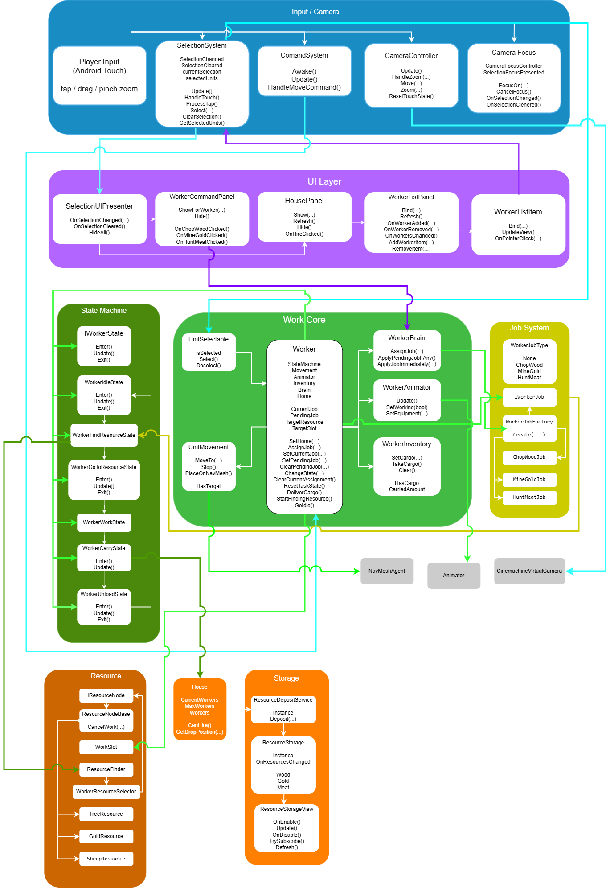

# MyTinySword

> 2D RTS-прототип на Unity с системой рабочих, добычей ресурсов и управлением юнитами.

---

# О проекте

**MyTinySword** — это прототип 2D RTS-игры, созданный на Unity 

Проект реализует базовые механики стратегии в реальном времени:

- управление юнитами
- добыча ресурсов
- взаимодействие со зданиями
- найм рабочих
- базовую игровую экономику

Проект создан как **portfolio project**, чтобы продемонстрировать навыки разработки gameplay систем, архитектуры кода и работы с Unity.

---
## Платформа
Основная целевая платформа:

- Android

Игра поддерживает управление через **touch-интерфейс**, включая:

- выделение юнитов касанием
- управление через touch-команды
- масштабирование камеры через жест **pinch-to-zoom**
- перемещение камеры

Проект адаптирован под управление без клавиатуры и мыши.
---
# Геймплей

---

# Скриншоты

---

# Основные механики

### Управление юнитами
- выделение юнитов
- отправка команд
- перемещение по карте

### Экономика
- добыча ресурсов
- перенос ресурсов на базу
- найм новых рабочих

### Игровой мир
- Tilemap карта
- взаимодействие с ресурсами
- взаимодействие со зданиями

### Анимации
- движение
- idle состояние
- рабочие действия

---

# Использованные технологии

- **Unity**
- **C#**
- **NavMeshPlus**
- **Cinemachine**
- **Tilemap**
- **Rule Tiles**
- **Animator**
- **Blend Tree**
- **Unity UI**

---

# Архитектура проекта

Проект разделён на несколько логических подсистем.

- Input System
- Selection System
- Command System
- Units
- Worker Logic
- Buildings
- Resources
- UI
- Animation

---
# Архитектурная схема проекта

---

## Подробное описание архитектуры проекта
Архитектура проекта построена по принципу разделения ответственности: ввод игрока, выбор объектов, логика юнитов, поведение рабочих, взаимодействие с ресурсами, работа построек, UI и Unity-компоненты разделены на отдельные подсистемы. Это упрощает поддержку проекта, рефакторинг и дальнейшее расширение механик.

### 1. Входной слой: Player Input / Selection / Command

Верхний уровень системы — это взаимодействие игрока с игрой.

Игрок управляет проектом через мобильный ввод:
- касания по экрану
- выбор юнитов
- команды перемещения
- выбор действий через UI
- управление камерой
- pinch-to-zoom

Основные скрипты этого слоя:

#### SelectionSystem
Отвечает за:
- выбор игровых объектов
- хранение текущего выделения
- переключение между выбранными объектами
- уведомление других систем о смене выбора

Именно через `SelectionSystem` игра понимает, какой объект сейчас выбран игроком.

#### CommandSystem
Отвечает за:
- обработку команд игрока
- передачу команд выбранным юнитам
- запуск логики перемещения или работы

Этот слой не выполняет работу сам, а передаёт команду дальше в логику конкретного юнита.

#### CameraController / CameraFocusController
Эти компоненты отвечают за:
- перемещение камеры
- масштабирование
- фокус на выбранном объекте
- удобную навигацию по карте

Это особенно важно для Android-версии проекта, так как камера должна быть удобной для touch-управления.

---

### 2. UI-слой

Следующий уровень — пользовательский интерфейс.

UI не содержит основную игровую логику, а служит промежуточным слоем между игроком и системами игры.

#### SelectionUiPresenter
Следит за выбранным объектом и определяет, какую панель нужно показать:
- панель рабочего
- панель дома
- скрытие UI при снятии выделения

#### WorkerCommandPanel
Позволяет игроку назначать рабочему конкретную задачу:
- рубка дерева
- добыча золота
- охота / получение мяса

После выбора действия панель передаёт задачу дальше в систему логики рабочего.

#### HousePanel
Показывает информацию о доме:
- количество рабочих
- лимит рабочих
- стоимость найма
- доступность найма

Также через эту панель игрок может нанимать новых рабочих.

#### WorkerListPanel / WorkerListItem
Отображают список рабочих, принадлежащих дому.

Через эти элементы можно:
- увидеть текущих рабочих
- выбрать нужного рабочего из UI
- синхронизировать UI со списком юнитов в доме

Таким образом UI не дублирует данные, а только визуализирует текущее состояние игровых объектов.

---

### 3. Центральный слой — Worker Core

Центральная часть архитектуры — это сам `Worker`.

Именно этот класс является главным исполнителем игрового поведения рабочего.

`Worker` хранит и координирует:
- текущее состояние
- текущую задачу
- ожидающую задачу
- домашнее здание
- целевой ресурс
- рабочий слот
- инвентарь
- ссылки на сервисы движения, анимации и логики

Основные задачи `Worker`:
- принять команду
- определить, что нужно делать
- переключить состояние
- передать управление нужной подсистеме
- обновить анимацию
- доставить ресурс
- перейти в idle или продолжить работу

Проще говоря, `Worker` — это центральная точка, через которую проходят почти все игровые данные, связанные с рабочим.

---

### 4. Сервисы рабочего

Чтобы не перегружать класс `Worker`, часть логики вынесена в отдельные сервисы.

#### WorkerBrain
Отвечает за обработку задач рабочего:
- назначение новой job
- применение pending job
- выбор момента переключения между задачами

Этот слой управляет логикой “что рабочий должен делать”.

#### WorkerInventory
Хранит информацию о том:
- несёт ли рабочий ресурс
- сколько ресурса у него в инвентаре
- когда нужно очистить инвентарь
- когда нужно передать ресурс в хранилище

#### WorkerAnimator
Связывает игровую логику с Animator.

Он обновляет параметры анимации на основе поведения рабочего:
- движение
- idle
- работа
- перенос ресурса
- экипировка

#### UnitMovement
Отвечает за перемещение рабочего:
- установка точки назначения
- остановка
- взаимодействие с NavMeshAgent
- проверка, движется ли юнит

Таким образом логика рабочего разделена на несколько независимых модулей, а не собрана в один перегруженный скрипт.

---

### 5. State Machine рабочего

Поведение рабочего построено на системе состояний.

Это один из ключевых архитектурных элементов проекта.

Вместо большого количества `if/else` логика разбита на отдельные state-классы, каждый из которых отвечает только за свою фазу поведения.

#### IWorkerState
Общий интерфейс состояний.

Каждое состояние реализует общий жизненный цикл:
- `Enter()`
- `Update()`
- `Exit()`

#### Основные состояния рабочего
- `WorkerIdleState` — ожидание
- `WorkerFindResourceState` — поиск подходящего ресурса
- `WorkerGoToResourceState` — движение к ресурсу
- `WorkerWorkState` — добыча / выполнение работы
- `WorkerCarryState` — перенос ресурса к базе
- `WorkerUnloadState` — сдача ресурса

Такая схема позволяет:
- легче поддерживать код
- проще добавлять новые типы поведения
- быстрее отлаживать баги
- ясно видеть текущую фазу работы юнита

---

### 6. Job-система рабочего

Поверх state machine работает отдельная система задач.

Рабочий может иметь разные типы работ, которые определяют, какой ресурс он будет искать и как будет себя вести.

#### WorkerJobType
Описывает типы работ:
- `None`
- `ChopWood`
- `MineGold`
- `HuntMeat`

#### IWorkerJob
Абстракция конкретной рабочей задачи.

#### WorkerJobFactory
Создаёт нужную реализацию job в зависимости от выбранного типа работы.

#### Конкретные job-классы
- `ChopWoodJob`
- `MineGoldJob`
- `HuntMeatJob`

Это позволяет отделить тип задачи от state machine.

State machine отвечает за **как** рабочий действует, а job-система отвечает за **что именно** он должен делать.

---

### 7. Система ресурсов

Рабочий взаимодействует не напрямую с абстрактным “ресурсом”, а с отдельной ресурсной подсистемой.

#### IResourceNode / ResourceNodeBase
Базовые сущности ресурсов.

Они определяют:
- доступность ресурса
- возможность начала/отмены работы
- связь с рабочими слотами
- остаток ресурса

#### WorkSlot
Используется для назначения конкретного места работы у ресурса.

Это помогает разделять точки доступа к одному ресурсному объекту.

#### ResourceFinder / WorkerResourceSelector
Отвечают за поиск подходящего ресурса для рабочего:
- по типу job
- по доступности
- по рабочим слотам
- по текущему состоянию ресурса

#### Конкретные ресурсы
- `TreeResource`
- `GoldResource`
- `SheepResource`

Таким образом рабочий сначала получает job, затем система ресурсов помогает ему найти нужную цель для этой job.

---

### 8. Дом и доставка ресурсов

`House` играет важную роль в общем цикле работы рабочего.

Дом отвечает за:
- хранение списка рабочих
- найм новых рабочих
- определение точки сдачи ресурсов
- взаимодействие с UI дома

Во время работы цикл выглядит так:

1. рабочий получает задачу  
2. находит ресурс  
3. добывает ресурс  
4. несёт его домой  
5. дом принимает ресурс  
6. ресурс отправляется в общее хранилище  
7. UI обновляет отображение запасов  

Этот цикл формирует основу экономической системы проекта.

---

### 9. Хранилище ресурсов и обновление UI

После того как рабочий приносит ресурс в дом, он не остаётся только внутри `House`.

Дальше в работу включаются:

#### ResourceDepositService
Отвечает за передачу добытого ресурса в общее хранилище.

#### ResourceStorage
Центральное хранилище ресурсов проекта.

Оно содержит:
- дерево
- золото
- мясо

И уведомляет UI об изменениях.

#### ResourceStorageView
Отображает текущее количество ресурсов на экране.

Таким образом данные проходят полный путь:

**Worker -> House -> ResourceDepositService -> ResourceStorage -> UI**

Это важная цепочка, потому что она показывает завершённый цикл данных в игре.

---

### 10. Unity Runtime Components

Нижний слой схемы — это Unity-компоненты, на которые опирается логика проекта.

#### NavMeshAgent
Используется для перемещения юнитов по карте.

#### Animator
Используется для проигрывания анимаций в зависимости от состояния рабочего.

#### CinemachineVirtualCamera
Обеспечивает удобную работу камеры.

#### EventSystem
Используется для корректной работы UI и взаимодействия с касаниями.

Эти компоненты не принимают игровых решений сами по себе, но являются технической базой, через которую работают игровые скрипты.

---

### 11. Общий поток данных в системе

Главная идея схемы заключается в том, что данные проходят через проект по следующей цепочке:

**Player Input  
-> SelectionSystem / CommandSystem  
-> Worker  
-> WorkerBrain / StateMachine / Job  
-> Movement / Animator / Resources / House  
-> ResourceDepositService  
-> ResourceStorage  
-> UI**

Этот поток показывает:
- откуда приходят команды
- где они обрабатываются
- как они превращаются в действия юнита
- как результат работы рабочего влияет на экономику и интерфейс

---

### 12. Почему такая архитектура удобна

Такое разделение на слои и подсистемы даёт несколько преимуществ:

- упрощает чтение и поддержку проекта
- позволяет легче отлаживать поведение рабочего
- снижает связанность между скриптами
- делает возможным расширение проекта новыми jobs, ресурсами и типами юнитов

Эта архитектура показывает не только реализацию игровой механики, но и умение проектировать систему, в которой логика, UI и Unity-компоненты связаны между собой осмысленно и предсказуемо.
---

# Что я изучил

Во время разработки проекта я практиковался в:

- архитектуре игровых систем
- разделении логики между системами
- работе с NavMeshPlus
- работе с Tilemap
- настройке Animator и Blend Tree
- отладке игровых систем

---

# Как запустить проект

1. Склонировать репозиторий
2. Открыть проект в Unity
3. Открыть основную сцену
4. Нажать Play

---

# Планы на развитие

- улучшить AI рабочих
- добавить систему резервирования ресурсов
- добавить боевую систему
- улучшить UI
- расширить систему построек
- оптимизировать архитектуру

