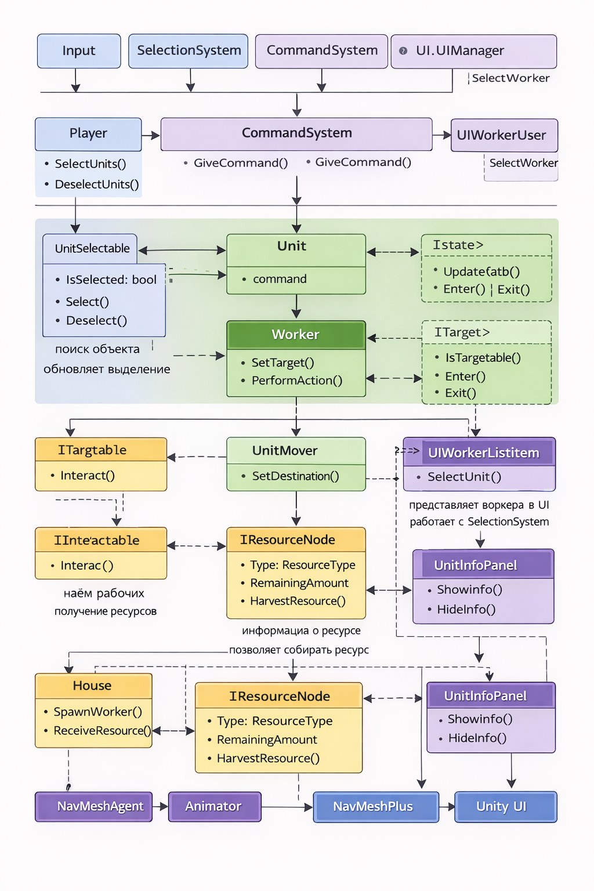

# MyTinySword

> 2D RTS-прототип на Unity с системой рабочих, добычей ресурсов и управлением юнитами.

---

# О проекте

**MyTinySword** — это прототип 2D RTS-игры, созданный на Unity 

Проект реализует базовые механики стратегии в реальном времени:

- управление юнитами
- добыча ресурсов
- взаимодействие со зданиями
- найм рабочих
- базовую игровую экономику

Проект создан как **portfolio project**, чтобы продемонстрировать навыки разработки gameplay систем, архитектуры кода и работы с Unity.

---
## Платформа
Основная целевая платформа:

- Android

Игра поддерживает управление через **touch-интерфейс**, включая:

- выделение юнитов касанием
- управление через touch-команды
- масштабирование камеры через жест **pinch-to-zoom**
- перемещение камеры

Проект адаптирован под управление без клавиатуры и мыши.
---

# Основные механики

### Управление юнитами
- выделение юнитов
- отправка команд
- перемещение по карте

### Экономика
- добыча ресурсов
- перенос ресурсов на базу
- найм новых рабочих

### Игровой мир
- Tilemap карта
- взаимодействие с ресурсами
- взаимодействие со зданиями

### Анимации
- движение
- idle состояние
- рабочие действия

---

# Использованные технологии

- **Unity**
- **C#**
- **NavMeshPlus**
- **Cinemachine**
- **Tilemap**
- **Rule Tiles**
- **Animator**
- **Blend Tree**
- **Unity UI**

---

# Архитектура проекта

Проект разделён на несколько логических подсистем.

- Input System
- Selection System
- Command System
- Units
- Worker Logic
- Buildings
- Resources
- UI
- Animation

---
# Архитектурная схема проекта

---

# Взаимодействие игровых систем

---

# Поведение рабочего

Рабочий выполняет следующие этапы поведения:

1. ожидание
2. движение к ресурсу
3. добыча ресурса
4. перенос ресурса
5. возвращение на базу
6. сдача ресурса

---

# Как работает проект в Unity

Проект построен на **компонентной архитектуре Unity**.

Игровая логика разделена между несколькими уровнями:

### Игрок

Игрок взаимодействует с игрой через:

- простым касанием экрана
- UI
- команды

### Система ввода

Обрабатывает клики и команды игрока.

Основные скрипты:

- SelectionSystem
- CommandSystem

### Юниты

Юниты получают команды от игрока и выполняют действия.

### Ресурсы

Ресурсы представлены отдельными объектами.

### Постройки

Постройки создают новых рабочих и принимают ресурсы.

### Анимация

Анимации реализованы через:

- Animator
- Blend Tree

### Навигация

Навигация реализована через:

NavMeshPlus

### Камера

Камера управляется системой:

Cinemachine

### Карта

Карта построена через:

- Tilemap
- Rule Tiles

---

# Применённые принципы разработки

### Компонентная архитектура

Каждый объект состоит из нескольких компонентов.

### Инкапсуляция

Каждый скрипт отвечает за свою часть логики.

### Разделение ответственности

Игровая логика разделена между различными системами.

### State-based behaviour

Поведение рабочих реализовано через систему состояний.

---

# Что я изучил

Во время разработки проекта я практиковался в:

- архитектуре игровых систем
- разделении логики между системами
- работе с NavMeshPlus
- работе с Tilemap
- настройке Animator и Blend Tree
- отладке игровых систем

---

# Геймплей

### Найм рабочего

*(вставь gif или видео)*

---

### Выделение юнитов

*(вставь gif)*

---

### Добыча ресурсов

*(вставь gif)*

---

# Скриншоты

---

# Видео геймплея

*(вставь ссылку на YouTube или видео)*
---

# Как запустить проект

1. Склонировать репозиторий
2. Открыть проект в Unity
3. Открыть основную сцену
4. Нажать Play

---

# Планы на развитие

- улучшить AI рабочих
- добавить систему резервирования ресурсов
- добавить боевую систему
- улучшить UI
- расширить систему построек
- оптимизировать архитектуру

