Последние изменения README были 28 мая 2026 года 
с того момента добавилось множество новой механики и теперь игра напрвлена на Яндекс игры 

Добавленно:
-Обучение
-Дополнительные уровни
-Дерево развития
-Исправлены множество багов
-Где-то переделан UI
-Небольшая механика для удобства:
    снос зданий
    управление всеми рабочими дома
- Небольшое изменение в визуале

  
# MyTinySword

**MyTinySword** — 2D RTS-прототип на Unity под Android.

Проект разрабатывается с нуля с упором на **архитектуру игровых систем**, **масштабируемость**, **чистый C# код**, разделение ответственности и постепенный переход к production структуре через **Zenject**, фабрики, реестры, ScriptableObject-конфиги и событийное обновление UI.

В проекте реализованы рабочие юниты/найм их, добыча 3 видов ресурсов, строительство зданийи и снос, производство армии, базовая боевая система, UI-панели, управление камерой и внедрение зависимостей и звук

---

## Содержание

- [Краткое описание геймплея](#краткое-описание-геймплея)
- [Технологии](#технологии)
- [Общая архитектура](#общая-архитектура)
- [Архитектурные блоки](#архитектурные-блоки)
  - [1. Config / Data](#1-config--data)
  - [2. Input / Selection](#2-input--selection)
  - [3. Camera](#3-camera)
  - [4. Resource](#4-resource)
  - [5. Worker](#5-worker)
  - [6. Buildings](#6-buildings)
  - [7. Army](#7-army)
  - [8. Combat](#8-combat)
  - [9. UI](#9-ui)
  - [10. Audio](#10-Audio)
  - [11. Installer / Zenject](#11-installer--zenject)
- [Используемые архитектурные подходы](#используемые-архитектурные-подходы)
- [Android / Performance](#android--performance)
- [Реализовано сейчас](#реализовано-сейчас)
- [Структура проекта](#структура-проекта)
- [Статус проекта](#статус-проекта)

---


## Краткое описание геймплея

https://github.com/user-attachments/assets/56568f65-4bf9-42af-8910-d71f75036c83

Игрок может:

- выбирать рабочих, здания, строительные слоты и боевых юнитов;
- назначать рабочим задачи: рубка дерева, добыча золота, охота за мясом;
- собирать ресурсы;
- строить здания через строительные слоты;
- нанимать рабочих в доме;
- производить боевых юнитов в зданиях;
- выбирать группу армии;
- отдавать армии команды движения и атаки;
- сражаться с врагами .

https://github.com/user-attachments/assets/60037a2c-d134-4689-ad30-3ab36f1206bd

---

## Технологии

| Область | Используется |
|---|---|
| Engine | Unity |
| Язык | C# |
| Платформа | Android |
| Dependency Injection | Zenject / Extenject |
| Реактивность / события | UniRx, C# events |
| Навигация | NavMesh / NavMeshPlus |
| Камера | Cinemachine |
| Уровень | Tilemap / RuleTiles |
| UI | Unity UI, TextMeshPro |
| Контроль версий | Git / GitHub |

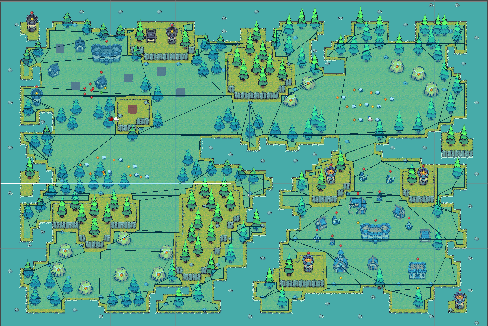

---

## Общая архитектура

Проект разделён на независимые игровые блоки:

```text
Config / Data
Input / Selection
Camera
Resource
Worker
Buildings
Army
Combat
UI
Installer / Zenject
```

Каждый блок отвечает за свою область и взаимодействует с другими системами через:

- события;
- интерфейсы;
- реестры;
- фабрики;
- ScriptableObject-конфиги;
- внедрение зависимостей через Zenject / Extenject.

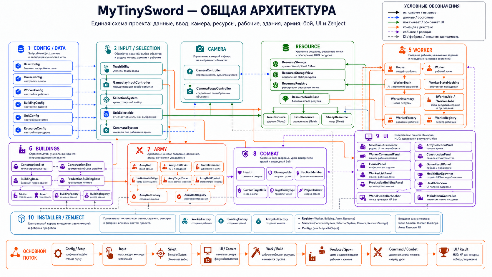

---

## Архитектурные блоки

---

## 1. Config / Data

Данные игры вынесены в ScriptableObject-конфиги.  
Runtime-классы  читают параметры из конфигов.

Основные классы:

- `BaseConfig`
- `WorkerConfig`
- `HouseConfig`
- `BuildingConfig`
- `UnitConfig`
- `MeleeUnitConfig`
- `RangedUnitConfig`
- `HealerUnitConfig`
- `ResourceConfig`
- `TreeResourceConfig`
- `GoldResourceConfig`
- `SheepResourceConfig`
- `AudioConfig`

Такой подход позволяет менять баланс игры через Inspector без изменения gameplay-кода.

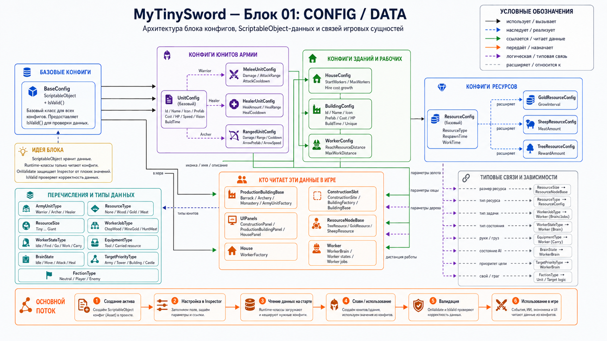

---

## 2. Input / Selection

Блок ввода отвечает за touch-input, фильтрацию UI, выбор объектов и выдачу команд армии.

Основные классы:

- `TouchUtility`
- `GameplayInputController`
- `SelectionSystem`
- `UnitSelectable`
- `CommandSystem`
- `SelectionUiPresenter`

`GameplayInputController` является центральной точкой обработки touch-ввода.  
`SelectionSystem` хранит текущий выбор, а `CommandSystem` отдаёт выбранной армии команды движения или атаки.

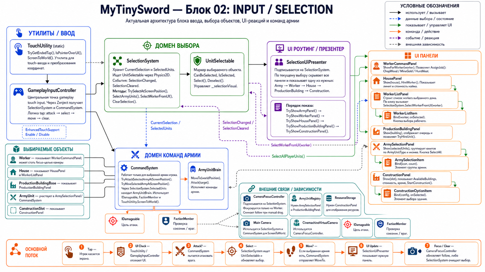

---

## 3. Camera

Блок камеры отвечает за ручное перемещение, zoom и фокус на выбранных объектах.

Основные классы:

- `CameraController`
- `CameraFocusController`

Особенности:

- ручной drag камеры;
- масштабирование камеры;
- ограничение zoom;
- фокус на выбранном объекте;
- отмена auto-follow при ручном перемещении камеры;
- использование Cinemachine.

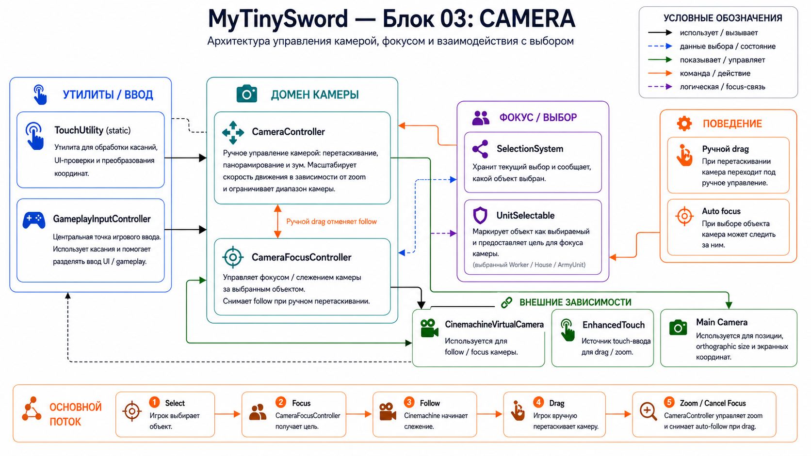

---

## 4. Resource

Ресурсная система отвечает за хранение ресурсов, ресурсные точки, поиск доступного ресурса, резерв рабочих мест и обновление UI.

Основные классы:

- `ResourceStorage`
- `ResourceStorageView`
- `ResourceRegistry`
- `ResourceNodeBase`
- `TreeResource`
- `GoldResource`
- `SheepResource`
- `WorkSlot`
- `WorkerResourceSelector`

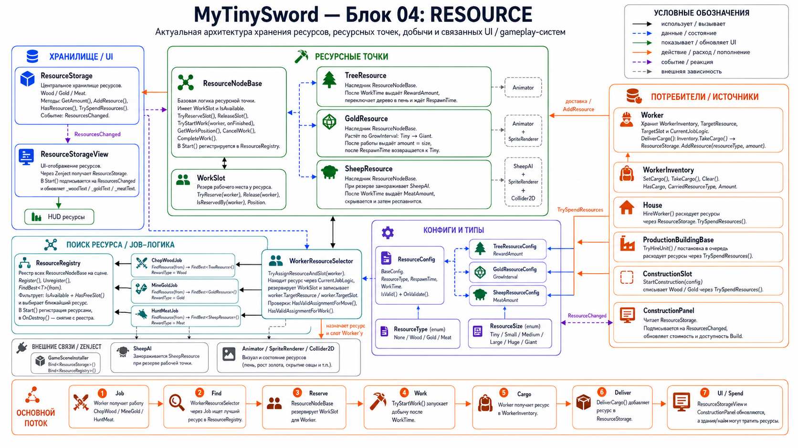

---

## 5. Worker

Рабочий построен не как один большой монолитный класс, а как набор связанных компонентов:

- сущность рабочего;
- мозг;
- state machine;
- inventory;
- jobs;
- animator;
- selector ресурсов.

Основные классы:

- `Worker`
- `WorkerBrain`
- `WorkerStateMachine`
- `WorkerInventory`
- `WorkerAnimator`
- `WorkerResourceSelector`
- `IWorkerJob`
- `ChopWoodJob`
- `MineGoldJob`
- `HuntMeatJob`

Состояния рабочего:

```text
Idle
FindResource
GoToResource
Work
Carry
```

Цикл поведения:

```text
Idle
→ FindResource
→ GoToResource
→ Work
→ Carry
→ Idle / FindResource
```

Работы реализованы через Strategy-подход:

```text
IWorkerJob
├── ChopWoodJob
├── MineGoldJob
└── HuntMeatJob
```

Это позволяет добавлять новые типы работ без переписывания всей логики рабочего.

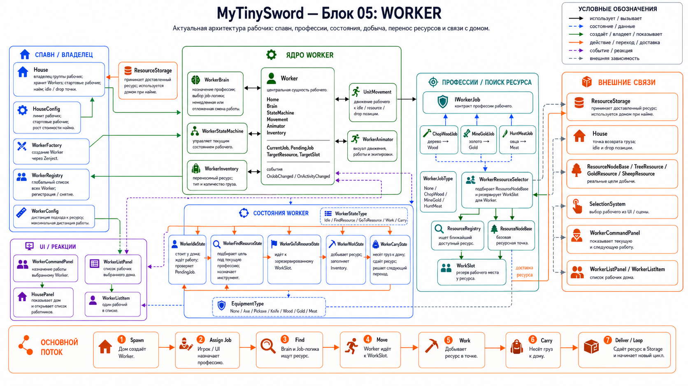

---

## 6. Buildings

Блок зданий отвечает за строительство, базовые здания, производственные здания, дом, башню и правила уникальных построек.

Основные классы:

- `BuildingBase`
- `BuildingConfig`
- `ConstructionSlot`
- `ConstructionSite`
- `BuildingFactory`
- `BuildingRegistry`
- `House`
- `ProductionBuildingBase`
- `Castle`
- `Tower`

`BuildingRegistry` следит за уникальными зданиями, чтобы нельзя было построить больше одного здания с ограничением `UniqueBuilding`.

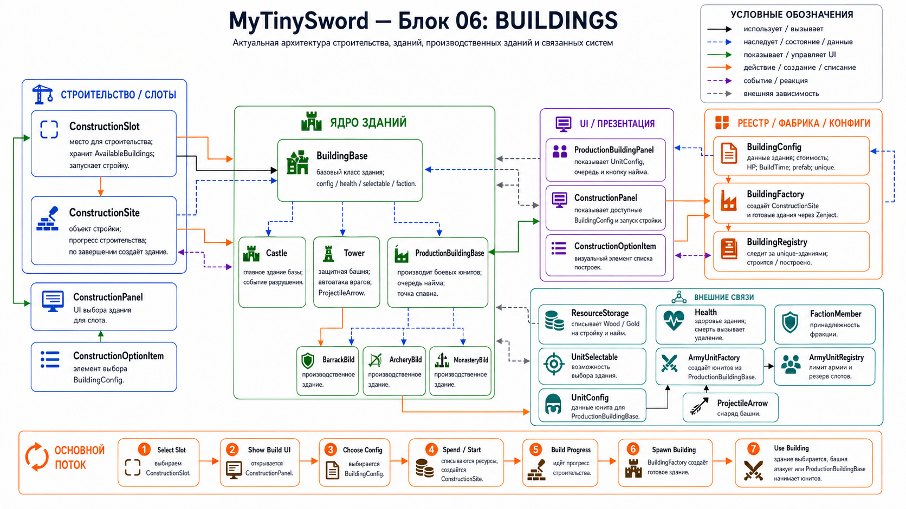

---

## 7. Army

Блок армии отвечает за создание боевых юнитов, регистрацию армии, выбор группы, движение и поведение юнитов.

Основные классы:

- `ArmyUnit`
- `ArmyUnitBrain`
- `ArmyTargetFinder`
- `ArmyUnitCombat`
- `ArmyUnitFactory`
- `ArmyUnitRegistry`
- `UnitMovement`
- `UnitAnimatorBridge`

Типы юнитов:

```text
Warrior
Archer
Healer
```

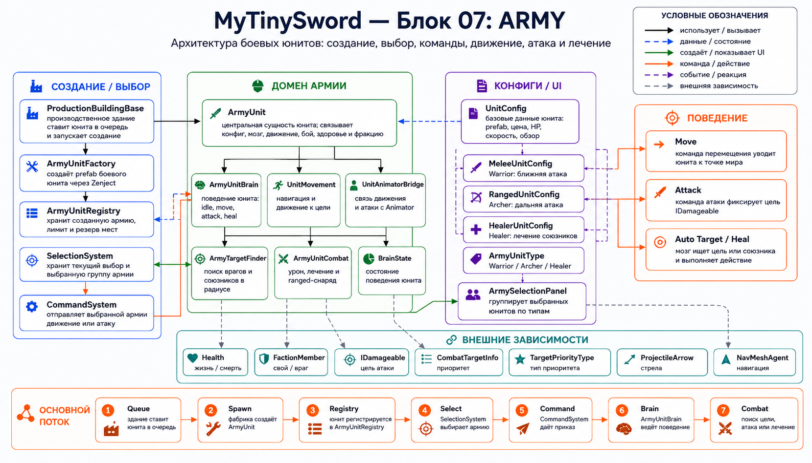

---

## 8. Combat

Боевая система отвечает за здоровье, урон, лечение, поиск целей, приоритеты, снаряды, башни и результат боя.

Основные классы:

- `Health`
- `IDamageable`
- `FactionMember`
- `CombatTargetInfo`
- `TargetPriorityType`
- `ArmyTargetFinder`
- `ArmyUnitCombat`
- `ProjectileArrow`
- `Tower`
- `GameResultController`
- `GameResultPanel`

Боевая логика поддерживает:

- melee-атаку;
- ranged-атаку через `ProjectileArrow`;
- лечение союзников;
- авто-поиск целей;
- приоритет целей;
- tower-атаку;
- победу / поражение через уничтожение Castle.

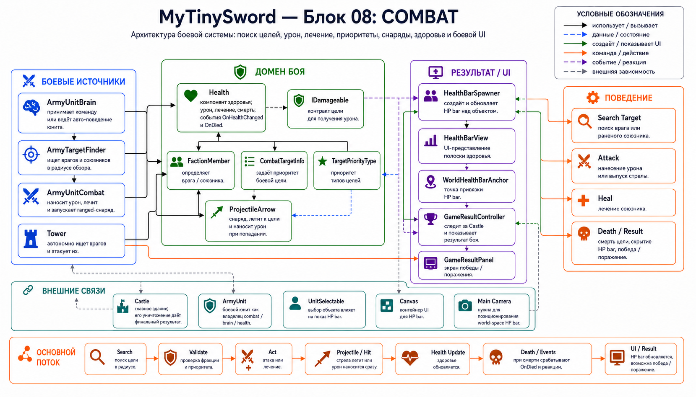

---

## 9. UI

UI отделён от основной gameplay-логики.  
Он реагирует на состояние игры, выбор объектов и события систем.

Основные классы:

- `SelectionUiPresenter`
- `ResourceStorageView`
- `WorkerCommandPanel`
- `HousePanel`
- `WorkerListPanel`
- `WorkerListItem`
- `ProductionBuildingPanel`
- `ArmySelectionPanel`
- `ArmySelectionItem`
- `ConstructionPanel`
- `ConstructionOptionItem`
- `GameResultPanel`
- `HealthBarSpawner`
- `HealthBarView`
- `WorldHealthBarAnchor`
- `MainMenuController`

`SelectionUiPresenter` выступает как UI-router:

UI не управляет игровой логикой напрямую.  
Он показывает данные и отправляет команды в соответствующие gameplay-системы.

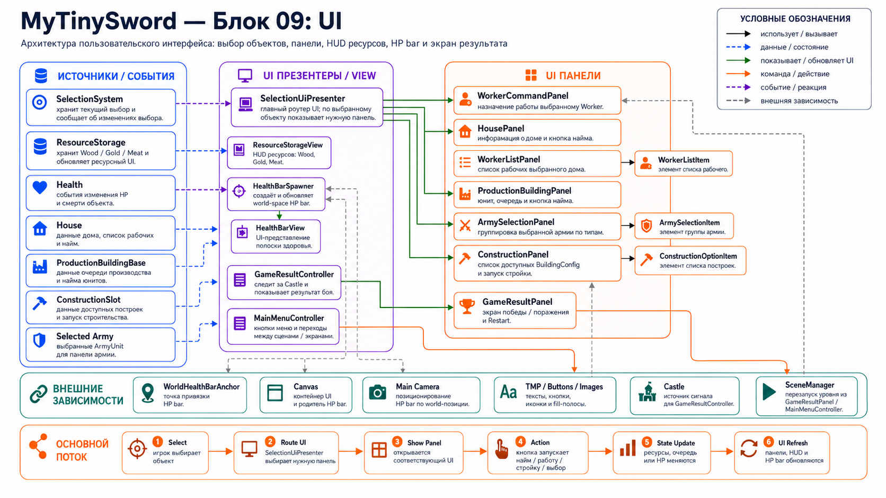

---
## 10. Audio
UI, боевые системы, строительство, рабочие и индикаторы не проигрывают AudioClip напрямую.

Все игровые объекты вызывают GameAudioService, а он уже решает:

какой SoundEntry использовать;
через какой канал проиграть звук;
учитывать ли позицию на карте;
какую громкость и mute-состояние применить.

Основные классы:

ProjectAudioInstaller
GameAudioService
AudioConfig
SoundEntry
SceneMusicEntry
AudioSettingsPanel
UiButtonSound
UiPanelOpenSound
HealthAudioFeedback
WorkerAnimator
MoveCommandIndicator
ConstructionSite
BuildingBase
ArmyUnitCombat
Tower

ProjectAudioInstaller создаёт глобальный AudioRoot через ProjectContext.
Благодаря этому GameAudioService существует между сценами, но настройки не сохраняются на устройство и сбрасываются после перезапуска игры.


UI-звуки проигрываются через UiSfxSource и не зависят от позиции камеры.
К ним относятся клики кнопок, открытие панелей, toggle и slider feedback.

World-звуки проигрываются через позиционный пул AudioSource.
К ним относятся звуки работы, атаки, получения урона, строительства, сноса здания и команды движения армии.
Такие звуки зависят от расстояния до камеры: рядом слышно громко, далеко — тише.

Музыка выбирается по имени активной сцены через AudioConfig.
Для каждой сцены можно назначить свой AudioClip через SceneMusicEntry.

AudioSettingsPanel управляет только UI-настройками громкости.
Она не работает напрямую с AudioMixer и AudioSource, а отправляет команды в GameAudioService.

Аудиосистема не управляет gameplay-логикой напрямую.
Она получает события из UI и игровых систем, выбирает нужный SoundId и проигрывает звук через подходящий канал.

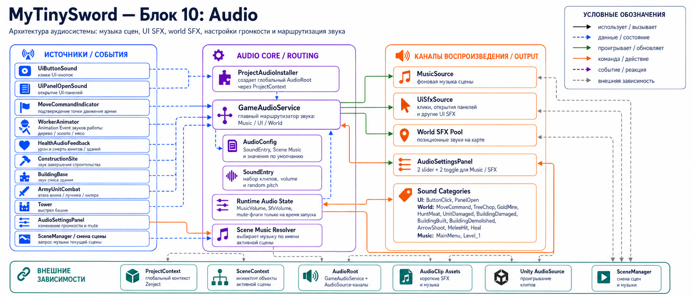

## 11. Installer / Zenject

Проект использует Zenject / Extenject для настройки зависимостей между системами.

Основной класс:

- `GameSceneInstaller`

Через Installer связываются:

- `ResourceStorage`
- `WorkerRegistry`
- `ResourceRegistry`
- `BuildingRegistry`
- `ArmyUnitRegistry`
- `SelectionSystem`
- `CommandSystem`
- `CameraFocusController`
- `WorkerListPanel`
- `SelectionUiPresenter`
- `WorkerFactory`
- `BuildingFactory`
- `ArmyUnitFactory`

Фабрики создают runtime-объекты через DI-контейнер:

```text
WorkerFactory → Worker
BuildingFactory → ConstructionSite / Building
ArmyUnitFactory → ArmyUnit
```

Это позволяет создаваемым объектам получать зависимости через `[Inject]`.


---

## Используемые архитектурные подходы

| Подход | Где используется |
|---|---|
| State Machine | Поведение Worker и ArmyUnit |
| Strategy | Работы рабочего через `IWorkerJob` |
| Factory | Создание Worker, Building, ArmyUnit |
| Registry | Учёт Worker, ResourceNode, Building, ArmyUnit |
| Dependency Injection | Zenject / Extenject |
| Event-driven UI | Обновление UI через события |
| Composition | Сущности собраны из маленьких компонентов |
| ScriptableObject Data | Баланс и настройки вынесены в конфиги |

---

## Android / Performance

Проект учитывает мобильную платформу:

- touch-first input;
- фильтрация UI перед gameplay-вводом;
- `NonAlloc` physics queries для выбора и поиска целей;
- кэширование ссылок;
- отказ от  `FindObjectOfType`;
- реестры вместо хаотичного поиска объектов;
- фабрики для контролируемого создания runtime-объектов;
- разделение логики по состояниям;
- контроль лишних runtime-зависимостей;
- уменьшение лишних аллокаций в часто вызываемых местах.

  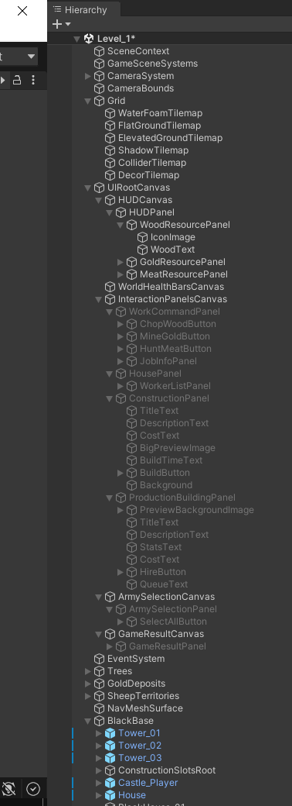

---

## Реализовано сейчас

- Touch-input под Android
- Выбор объектов,рабочих, зданий, строительных слотов, армии
- Команды движения,атаки армии
- Worker AI через state machine
- Добыча дерева, золота и охота на овец
- Инвентарь рабочего и доставка ресурсов домой
- Центральное хранилище ресурсов
- HUD ресурсов
- Найм рабочих
- Строительство зданий и их снос
- Производство боевых юнитов
- Реестр, лимит армии
- Health system
- HP bars над объектами
- Победа / поражение
- MainMenu
- Audio и ее настройка
- Camera drag / zoom ,focus
- Zenject installer
- Runtime factories
- ScriptableObject configs

---

## Статус проекта

Планируемые улучшения:

- сделать первый уровень Tutorial;
- добавить больше уровней
- сделать дерево развития
- квестовую историю 
- улучшить визуальный feedback;
- расширить типы зданий и юнитов;
- улучшить enemy AI;
- добавить wave-систему;

---
