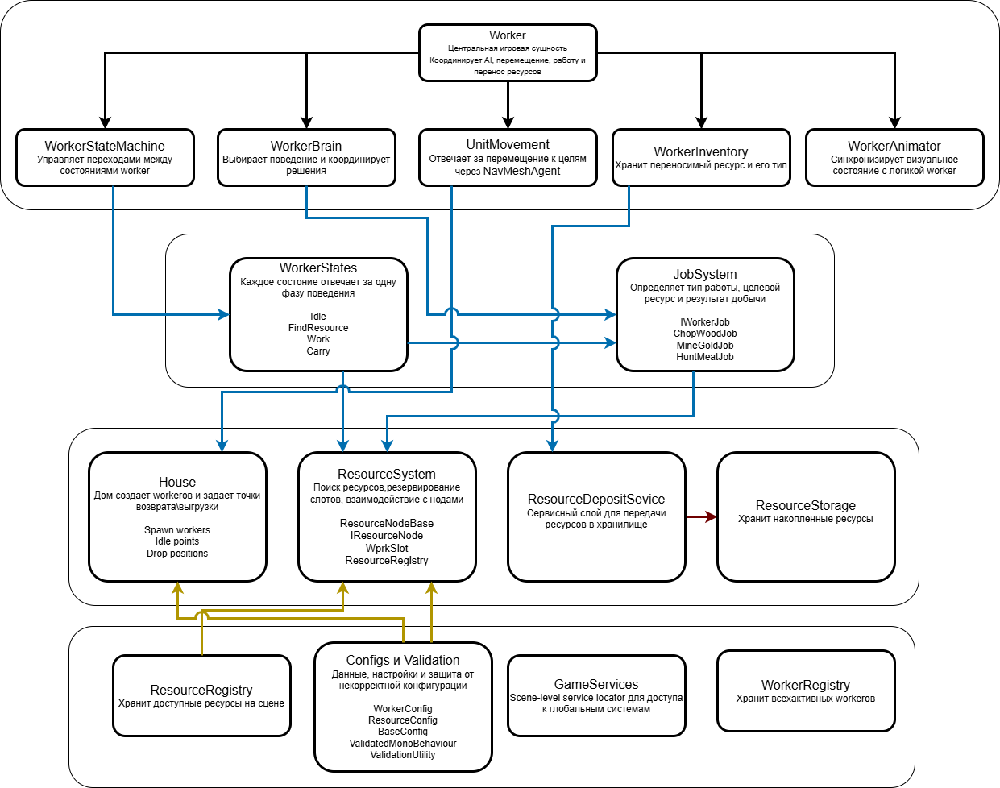

# MyTinySword

RTS-подобная игра на Unity (Android), в которой реализована система рабочих (Worker AI), добычи ресурсов и базовой экономики.

Проект сфокусирован не на контенте, а на **архитектуре, масштабируемости и чистоте кода**.  
Основная цель — продемонстрировать навыки построения игровых систем и работы с паттернами проектирования.

---
## Геймплей

Игрок управляет рабочими (Worker), которые:

- находят ресурсы (дерево, золото, овцы)
- добывают их
- переносят на базу
- участвуют в экономике

Цикл поведения рабочего:

Idle → FindResource → GoToResource → Work → Carry → Unload → Idle

https://github.com/user-attachments/assets/5bcb050b-01f7-4155-8b7e-e9263924de65

---

# Скриншоты

---

##  Архитектура проекта

Ниже представлена архитектурная схема, отражающая основные системы и их взаимодействие:

Проект построен на принципах:

- разделения ответственности (SRP)
- композиции вместо наследования
- слабой связанности систем
- расширяемости без изменения существующего кода

###  Общая идея архитектуры

В центре системы находится `Worker` — основная игровая сущность, которая координирует поведение, перемещение и взаимодействие с игровым миром.

Архитектура построена на разделении ответственности и композиции, где каждая подсистема отвечает за свою узкую задачу.

---

###  Внутреннее устройство Worker

Worker не является монолитным классом и состоит из набора компонентов:

- `WorkerStateMachine` — управляет текущим состоянием  
- `WorkerBrain` — принимает решения и выбирает поведение  
- `UnitMovement` — отвечает за перемещение  
- `WorkerInventory` — хранит переносимые ресурсы  
- `WorkerAnimator` — синхронизирует визуальное состояние  

Такой подход упрощает поддержку и делает систему расширяемой.

---

###  Система состояний (State Machine)

Поведение Worker разбито на независимые состояния:

- Idle  
- FindResource  
- GoToResource  
- Work  
- Carry  
- Unload  

Каждое состояние отвечает только за одну фазу поведения, что соответствует принципу Single Responsibility.

---

###  Job System (Strategy)

Логика работы вынесена в отдельные классы:

- ChopWoodJob  
- MineGoldJob  
- HuntMeatJob  

Worker не содержит логики добычи — он использует `IWorkerJob`, что позволяет легко добавлять новые типы работ без изменения существующего кода.

---

###  Взаимодействие с ресурсами

Worker взаимодействует с миром через `ResourceSystem`:

- поиск подходящего ресурса  
- резервирование `WorkSlot`  
- выполнение работы  

Система слотов предотвращает ситуацию, когда несколько worker’ов работают с одним и тем же ресурсом.

---

###  Экономика и перенос ресурсов

Процесс передачи ресурсов разделён на этапы:

1. Worker добывает ресурс  
2. Сохраняет его в `WorkerInventory`  
3. Передаёт через `ResourceDepositService`  
4. Ресурс попадает в `ResourceStorage`  

Worker не знает, куда именно складываются ресурсы — это инкапсулировано в сервисе.

---

###  Инфраструктурный слой

Дополнительные системы обеспечивают работу архитектуры:

- `GameServices` — доступ к глобальным системам  
- `WorkerRegistry` — хранит всех worker’ов  
- `ResourceRegistry` — хранит ресурсы на сцене  
- `Configs & Validation` — конфигурация и защита от ошибок  

---

###  Итог

Такая архитектура позволяет:

- легко добавлять новые типы ресурсов и работ  
- масштабировать поведение worker’ов  
- поддерживать код без усложнения логики  
- изолировать системы друг от друга  

---

##  Использованные паттерны

### State Pattern
Используется в WorkerStateMachine  
Разделяет поведение на независимые состояния.

### Strategy Pattern
Используется в IWorkerJob  
Позволяет менять поведение без изменения системы.

### Service Locator
Реализован через GameServices  
Обеспечивает доступ к глобальным системам.

### Registry Pattern
Используется для хранения сущностей (Worker, Resource)

---

##  Принципы ООП

### Single Responsibility Principle
Каждый класс отвечает за одну задачу:
- State → поведение
- Job → логика работы
- Worker → координация

### Open/Closed Principle
Можно добавлять новые Job или Resource без изменения существующего кода.

### Encapsulation
Внутренние детали Worker скрыты за методами:
- StartFindingResource()
- EnterWorkState()

### Composition over Inheritance
Worker собирается из компонентов, а не наследуется.

---

##  Оптимизация (Android)

- использование NavMeshAgent (2D режим)
- минимизация Update логики
- разделение логики по состояниям
- контроль перерасчёта пути (repath timer)

---

##  Recent Improvements

- проведён полный рефакторинг Worker AI
- разделены State и Job системы
- добавлена система WorkSlot (резервация)
- введён Service Layer для экономики
- улучшена стабильность поведения worker’ов
- добавлена валидация компонентов

---

##  Цель проекта

Продемонстрировать:

- архитектурное мышление
- умение строить масштабируемые системы
- знание паттернов проектирования
- чистый и поддерживаемый код

