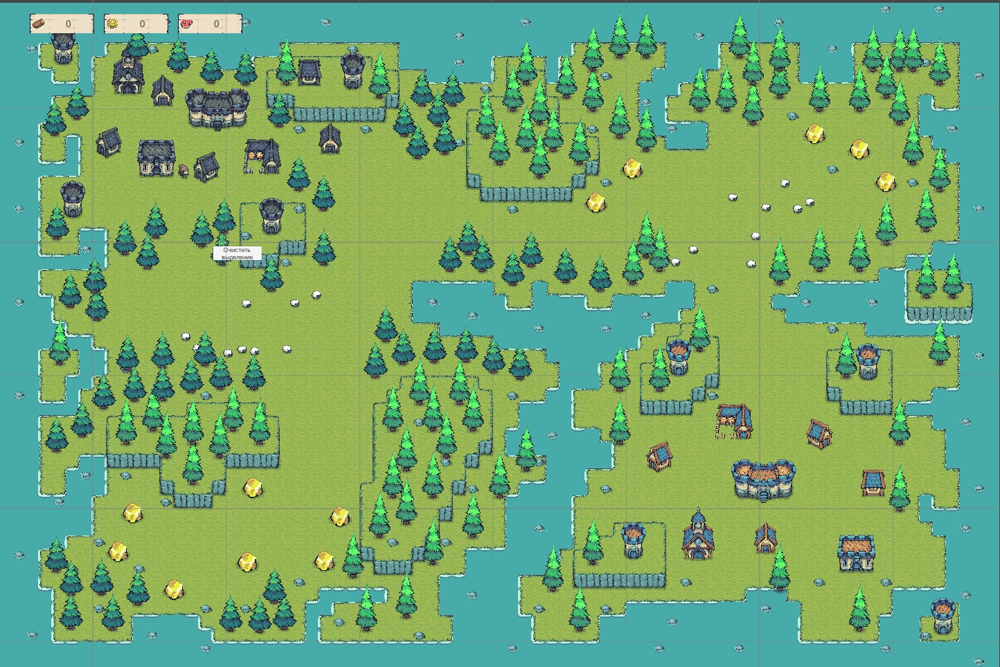
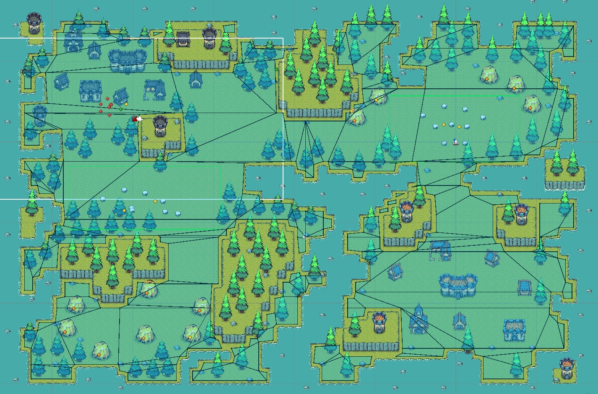
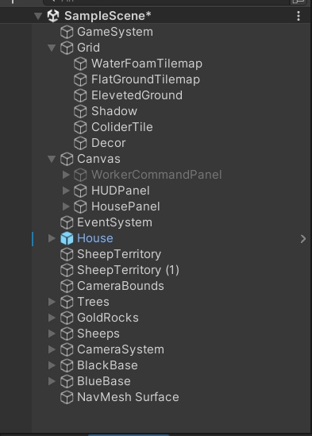

# MyTinySword

RTS-подобная игра на Unity (Android), в которой реализована система рабочих (Worker AI), добычи ресурсов и базовой экономики.

Проект сфокусирован не на контенте, а на **архитектуре, масштабируемости и чистоте кода**.  
Основная цель — продемонстрировать навыки построения игровых систем и работы с паттернами проектирования.

---
## Геймплей

Игрок управляет рабочими (Worker), которые:

- находят ресурсы (дерево, золото, овцы)
- добывают их
- переносят на базу
- участвуют в экономике

Цикл поведения рабочего:

Idle → FindResource → GoToResource → Work → Carry → Unload → Idle

https://github.com/user-attachments/assets/5bcb050b-01f7-4155-8b7e-e9263924de65

---

# Скриншоты

---

##  Архитектура проекта

Проект построен на принципах:

- разделения ответственности (SRP)
- композиции вместо наследования
- слабой связанности систем
- расширяемости без изменения существующего кода

### Основные архитектурные блоки:

- Worker AI (State Machine + Job System)
- Resource System (система ресурсов и слотов)
- Economy System (депозит и хранение ресурсов)
- Registry System (глобальный доступ к сущностям)
- Service Layer (логика поверх данных)

---

##  Worker AI (ключевая система)

Worker реализован как композиция независимых компонентов:

- WorkerStateMachine — управление состояниями  
- WorkerBrain — принятие решений  
- IWorkerJob — логика работы (Strategy)  
- UnitMovement — перемещение  
- WorkerInventory — перенос ресурсов  
- WorkerAnimator — визуальное состояние  

---

##  State Machine

Каждое состояние отвечает только за одну фазу поведения:

- WorkerIdleState — ожидание  
- WorkerFindResourceState — поиск ресурса  
- WorkerGoToResourceState — движение к ресурсу  
- WorkerWorkState — добыча  
- WorkerCarryState — перенос  
- WorkerUnloadState — выгрузка  

Это упрощает поддержку и делает систему предсказуемой.

---

##  Job System (Strategy Pattern)

Логика работы вынесена в отдельные классы:

- ChopWoodJob
- MineGoldJob
- HuntMeatJob

Каждый Job:

- определяет тип ресурса
- управляет поиском цели
- задаёт результат (что получаем)

Это позволяет добавлять новые типы работ без изменения Worker.

---

##  Resource System

Система ресурсов построена вокруг:

- ResourceNodeBase — базовый класс ресурса  
- WorkSlot — слот для работы  
- IResourceNode — интерфейс  
- ResourceRegistry — реестр ресурсов  

### Ключевая идея:

Worker не просто идёт к ресурсу, а:

1. Находит ресурс  
2. Резервирует WorkSlot  
3. Работает только если слот валиден  

Это предотвращает конфликты между worker’ами.

---

##  Экономика

Экономика разделена на несколько уровней:

- WorkerInventory — перенос ресурсов  
- ResourceDepositService — депозиты  
- ResourceStorage — хранение  

Worker не знает, куда "кладёт" ресурсы — это делает сервис.

---

## Registry System

Глобальные реестры:

- WorkerRegistry
- ResourceRegistry

Позволяют:

- быстро находить сущности
- избегать лишних поисков
- централизовать доступ

---

##  Service Layer

Пример:

- ResourceDepositService

Сервис инкапсулирует бизнес-логику и убирает её из Worker.

---

##  Использованные паттерны

### State Pattern
Используется в WorkerStateMachine  
Разделяет поведение на независимые состояния.

### Strategy Pattern
Используется в IWorkerJob  
Позволяет менять поведение без изменения системы.

### Service Locator
Реализован через GameServices  
Обеспечивает доступ к глобальным системам.

### Registry Pattern
Используется для хранения сущностей (Worker, Resource)

---

##  Принципы ООП

### Single Responsibility Principle
Каждый класс отвечает за одну задачу:
- State → поведение
- Job → логика работы
- Worker → координация

### Open/Closed Principle
Можно добавлять новые Job или Resource без изменения существующего кода.

### Encapsulation
Внутренние детали Worker скрыты за методами:
- StartFindingResource()
- EnterWorkState()

### Composition over Inheritance
Worker собирается из компонентов, а не наследуется.

---

##  Оптимизация (Android)

- использование NavMeshAgent (2D режим)
- минимизация Update логики
- разделение логики по состояниям
- контроль перерасчёта пути (repath timer)

---

##  Recent Improvements

- проведён полный рефакторинг Worker AI
- разделены State и Job системы
- добавлена система WorkSlot (резервация)
- введён Service Layer для экономики
- улучшена стабильность поведения worker’ов
- добавлена валидация компонентов

---

##  Цель проекта

Продемонстрировать:

- архитектурное мышление
- умение строить масштабируемые системы
- знание паттернов проектирования
- чистый и поддерживаемый код

